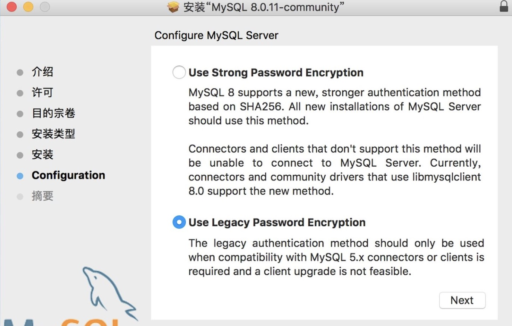

# MySQL 安装指南（mac）

## 下载安装包

直接在官网[https://dev.mysql.com/downloads/mysql/](https://dev.mysql.com/downloads/mysql/)下载对应版本安装包即可

## 安装

双击打开安装包，根据提示直接下一步，注意到如下图所示步骤时，选择第二个选项



最后一步记的给root用户设置密码

## 环境变量

最麻烦就是这块了

1. 打开命令行，输入并执行

```shell
cd /usr/local/mysql
```

2. 然后输入

```shell
sudo vim .bash_profile
```

3. 在文件中加入

```shell
export PATH=${PATH}:/usr/local/mysql/bin
```

保存文件并退出

4. 继续在命令行输入

```shell
source .bash_profile
```

5. 再输入

```shell
mysql -u root -p
```

## 解决命令行重启失效问题

如果用的是`zsh`, 还需要修改`~/.zshrc`

1. 命令行输入

```shell
vi ~/.zshrc
```

2. 在文件中加入

```shell
export PATH=${PATH}:/usr/local/mysql/bin
```

保存并退出

3. 命令行输入

```shell
source ~/.zshrc
```
这样再也不怕命令行重启了

